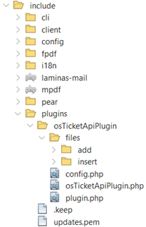
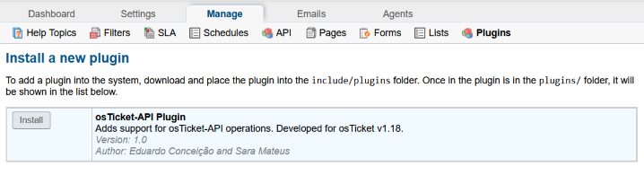
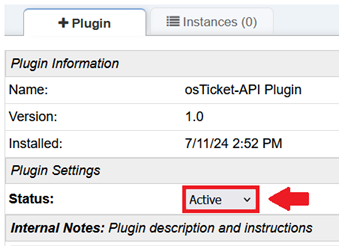
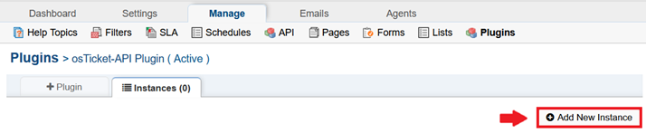
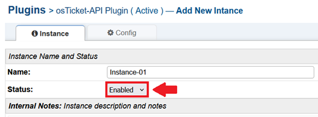
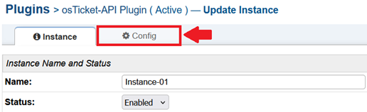
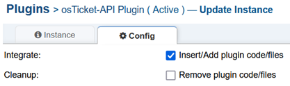
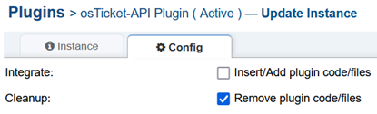

# osTicket-API Plugin Documentation

## Introduction

This guide provides detailed information on the installation, configuration, and usage of the osTicket-API Plugin. Designed specifically for the osTicket platform, this plugin enhances the system's functionality by integrating additional API capabilities, enabling seamless communication and data exchange with external applications.

The osTicket-API Plugin is engineered to ensure compatibility with version 1.18 of osTicket, offering robust features that streamline ticket management processes and improve overall system performance. With a focus on ease of use and flexibility, this plugin supports both novice and advanced users in customizing their osTicket environment to meet specific organizational needs.

Through this documentation, you will find step-by-step instructions for setting up the plugin and configuring its options. Whether you are an IT administrator, a developer, or a support technician, this guide will help you leverage the full potential of the osTicket-API Plugin to enhance your customer support operations.

## Features

The osTicket-API Plugin offers a wide range of features designed to enhance the functionality of your osTicket system. These features include:

- **Compatibility with osTicket Version 1.18**: Ensures that the plugin operates seamlessly with the specified version of osTicket.
- **Additional API Functionalities**: Extends the capabilities of the osTicket API with the following groups of endpoints:
  - **Departments**: 
    - Create, update, and delete departments.
    - Retrieve IDs of available departments.
  - **SLA (Service-Level Agreement)**:
    - Create, update, and delete SLAs.
    - Retrieve IDs of available SLAs.
  - **Staff**:
    - Create, update, and delete staff members.
    - Retrieve IDs of available staff members.
  - **Teams**:
    - Create, update, and delete teams.
    - Retrieve IDs of available teams.
  - **Tickets**:
    - Create, update, and delete tickets.
    - Retrieve and filter IDs of available tickets based on various properties.
  - **Ticket Priorities**:
    - Retrieve IDs of available ticket priorities.
  - **Ticket Status**:
    - Retrieve available ticket status IDs.
  - **Ticket Topics**:
    - Create, update, and delete ticket topics.
    - Retrieve IDs of available ticket topics.
  - **Users**:
    - Create, update, and delete users.
    - Retrieve IDs of available users.

- **Integration of Plugin Files**: Allows for the integration of plugin-specific files into the osTicket codebase.
- **Code Snippet Insertion via Regex Patterns**: Inserts necessary code snippets into the osTicket system using regex patterns defined in JSON files.
- **Easy Cleanup and Removal**: Provides functionality to easily remove the plugin's code and files from the osTicket system.

## Installation

Follow these steps to install the osTicket-API Plugin:

1. **Add Plugin Files to Directory**:
   - Download the 'osTicketApiPlugin' folder from: https://github.com/isel-leirt-pfc-eduardo-sara/osTicket/tree/develop/include/plugins.
   - Extract the folder to your local machine.
   - Transfer the extracted folder to the following directory on your osTicket installation:
     ```
     [INSTALL_ROOT]/include/plugins
     ```
    #### Like this:
    
      

2. **Add New Plugin**:
   - Log in to your osTicket administrator dashboard.
   - Navigate to `Admin Panel` -> `Manage` -> `Plugins` -> `Add New Plugin`.
   - Locate the transferred plugin in the list and click `Install`.
   
      

3. **Configure Plugin Settings**:
   - After installation, make sure the plugin's status is set to `Active`.

      

   - Save changes.

Once installed and configured, the osTicket-API Plugin will be ready for use.

## Configuration

### Adding an Instance

1. Navigate to `Admin Panel` -> `Manage` -> `Plugins` -> `osTicket-API Plugin` -> `Instances` -> `Add New Instance`.

    

2. Name your instance and ensure it is enabled.

    

3. Click `Add Instance`.

### Integrate API Code

1. Move to the `Config` tab of the previously added instance.

    

2. Tick the `Insert/Add plugin code/files` option.

    

3. Save changes.

#### Changes After Integration:
##### Files Added:
- [INSTALL_ROOT]/include/api.depts.php
- [INSTALL_ROOT]/include/api.priorities.php
- [INSTALL_ROOT]/include/api.sla.php
- [INSTALL_ROOT]/include/api.staff.php
- [INSTALL_ROOT]/include/api.status.php
- [INSTALL_ROOT]/include/api.teams.php
- [INSTALL_ROOT]/include/api.topics.php
- [INSTALL_ROOT]/include/api.users.php

##### Files Altered (Code Insertions):
- [INSTALL_ROOT]/api/http.json
- [INSTALL_ROOT]/include/api.tickets.json
- [INSTALL_ROOT]/include/class.api.json
- [INSTALL_ROOT]/include/class.dispatcher.json

### Remove API Code (Cleanup)

1. Move to the `Config` tab of the previously added instance.

    

2. Tick the `Remove plugin code/files` option.

    

3. Save changes.

## How It Works

### Integration of Plugin Files

The osTicket-API Plugin integrates additional functionality into your osTicket installation by adding specific files and inserting code snippets using predefined patterns. Here’s how it works:

1. **Adding Plugin Files**:
   - Upon configuring the plugin instance, you have the option to add plugin-specific files to your osTicket installation.
   - These files should be located in `[INSTALL_ROOT]/include/plugins/osTicketApiPlugin/files/add/`.
   - The plugin facilitates the transfer of these files to `[INSTALL_ROOT]`, ensuring they are accessible within the osTicket environment.

2. **Inserting Code Snippets**:
   - Code snippets necessary for the plugin's operation are inserted into key files of the osTicket system using regex patterns defined in JSON files.
   - These files should be located in `[INSTALL_ROOT]/include/plugins/osTicketApiPlugin/files/insert/`.
   - This process ensures that the plugin seamlessly extends the functionality of osTicket without manually modifying core files.

##### Example JSON for Code Insertion:

```json
[
    {
        "pattern": "/(# Add in static args specified in the constructor\\s+\\$args = array_merge\\(\\$args, \\$this->args\\);)/",
        "newLines": [
            "",
            "        // Access query parameters",
            "        $query_params = $_GET;",
            "",
            "        // Merge query parameters with other arguments",
            "        $args = array_merge($args, $query_params);",
            ""
        ]
    }
]
```

### Removing Added/Inserted Files and Code

After integrating with osTicket, the plugin provides functionality to remove added files and revert code insertions. Here’s how it works:

1. **Removing Plugin Files**:
   - The plugin identifies and removes previously added files from `[INSTALL_ROOT]`.
   - The plugin scans `[INSTALL_ROOT]` to identify files that match those in `[INSTALL_ROOT]/include/plugins/osTicketApiPlugin/files/add/`. Once identified, these files are removed from the osTicket installation.

2. **Undoing Code Insertions**:
   - Using the same JSON files that defined the insertions, the plugin reverts the inserted code snippets from key osTicket files.
   - This process ensures that osTicket's core files return to their original state, removing any modifications made by the plugin.
